## 新建工程步骤

### 1、在 Project 文件夹下新建一个文件夹命名为 adc_demo

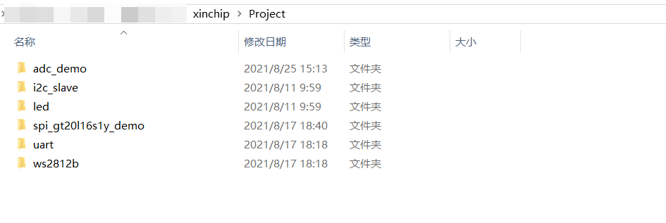

### 2、在新建好的 adc_demo 目录下新建一个 app 和 mdk 目录

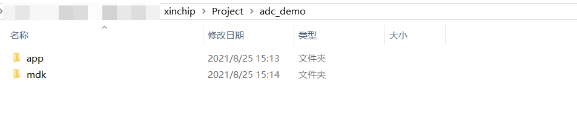

### 3、打开 keil 软件，新建一个工程，如下图所示

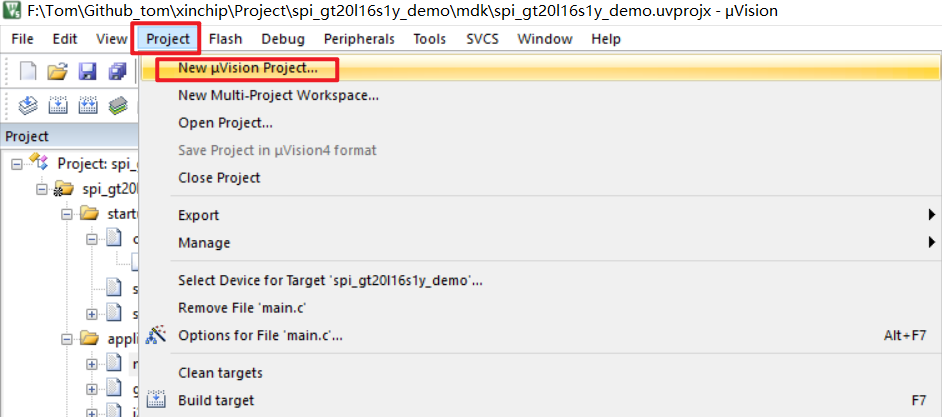

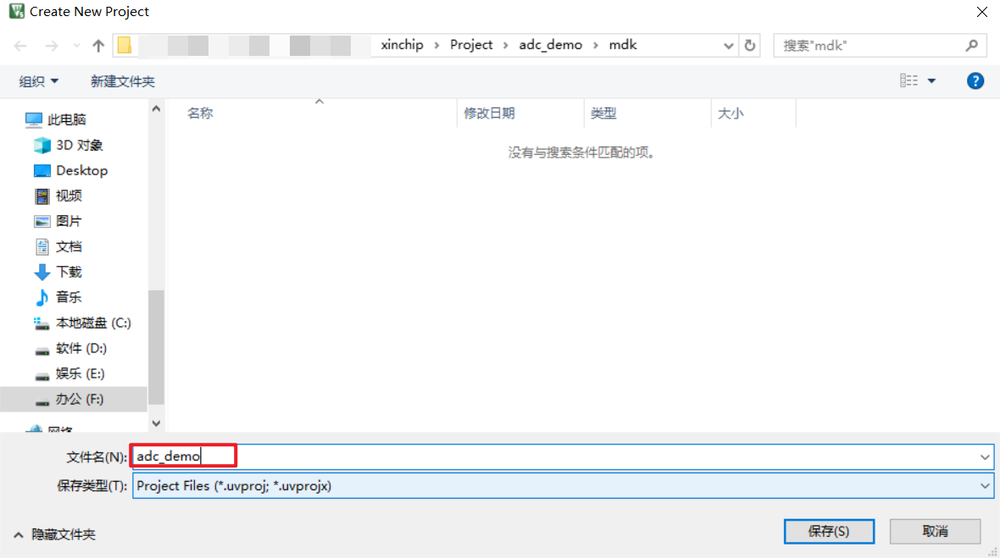

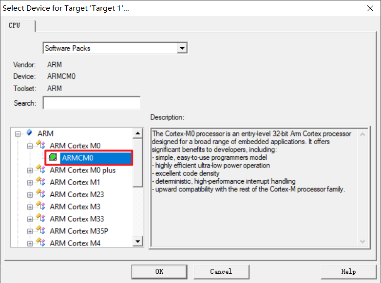

之后默认选择 OK 即可。

### 3、建立工程分组，并添加文件

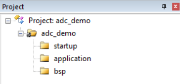

双击分组或者右键点击然后选择 Add Existing Files to Group ...

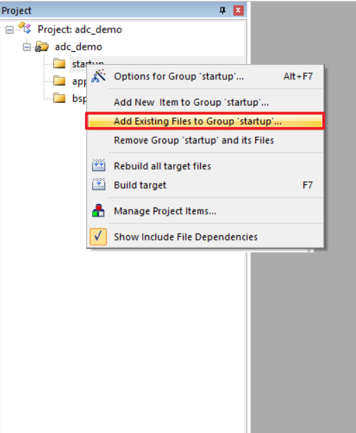

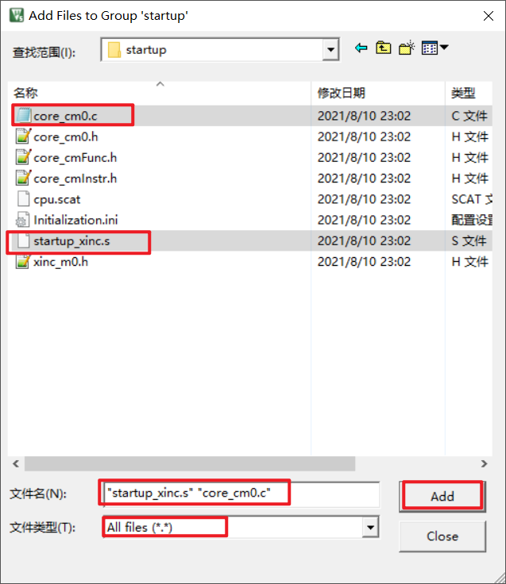

打开文件目录 startup 添加所需要的文件，文件类型选择 All files ,按下 Ctrl 可同时选中多个文件，最后点击 Add，添加完成。

其他分组和文件类似不再赘述。

### 4、配置编译和下载选项

点击如下图魔术棒

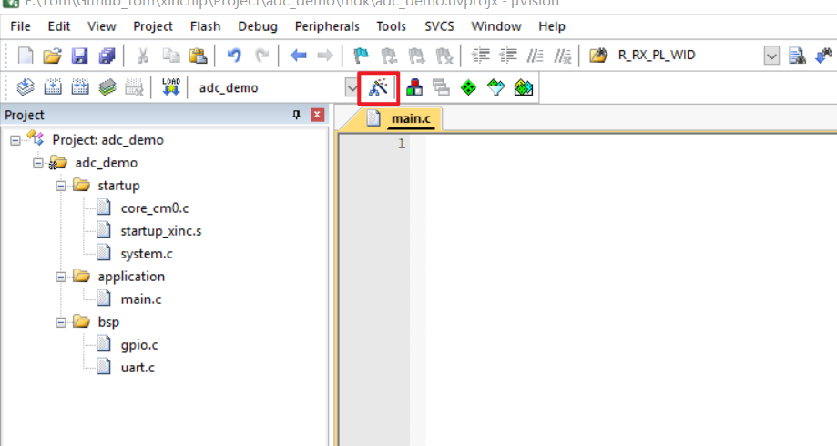

选择合适的编译器

添加编译路径

添加Scat文件

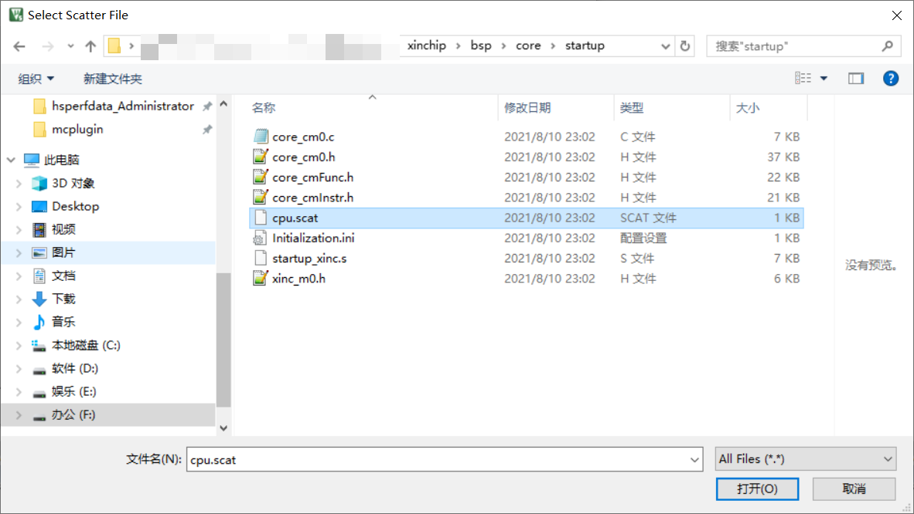

烧录方式选择（J-LINK 或者 ST-LINK 这里我们选择使用 ST-LINK 来烧录）

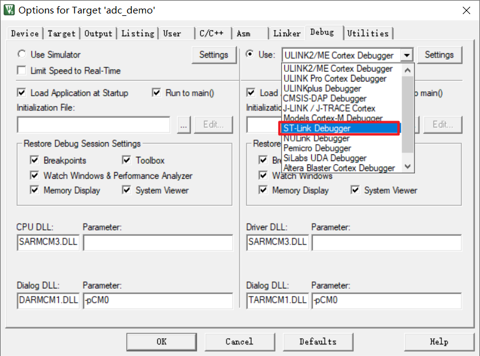

连接好 ST-LINK 和板子后点击 Settings 可以看到如下图所示

选择 Flash Download选项卡（进行此步骤前需要添加 FLM文件）

添加FLM文件：

将文件中的xc620.FLM文件添加到 Keil 安装目录下

点击 Add 按钮，选择 xc620 128KB Flash，点击添加

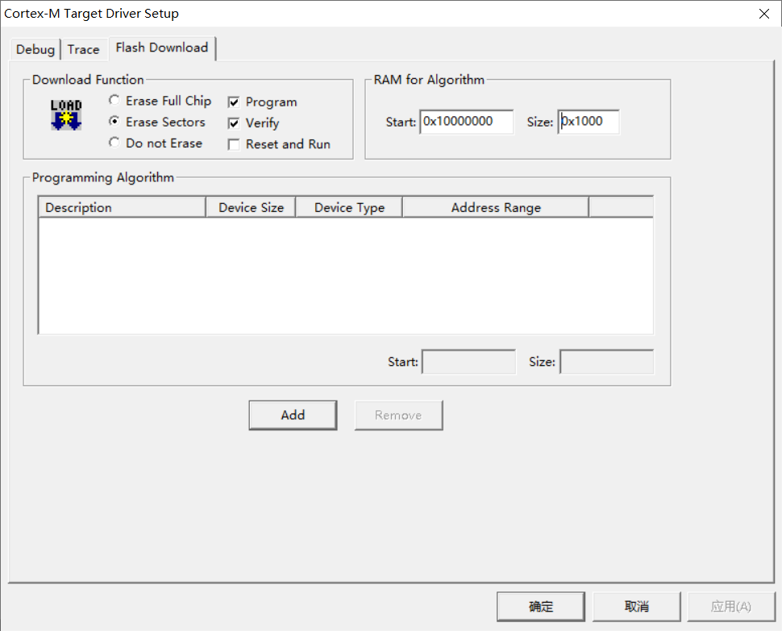

### 5、编译文件

编译输出显示 0 Error(s)，我们的工程就新建完成了。如果有报错可以根据报错信息去修改错误。

### 6、烧录程序到开发板

